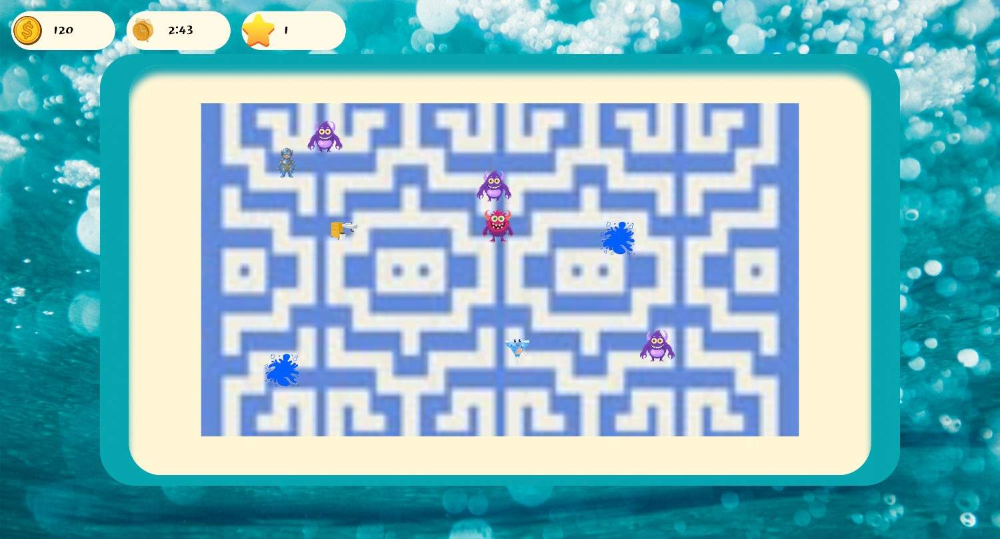

# WaterSense Game

## **Inspiration 💡**

Given the problem statement of addressing **low engagement in water conservation education**,  our team regrouped for brainstorming sessions and extensive research to determine the most effective solution. Through collaborative efforts and multiple meetings, we came up with **WaterSense**, a maze-based arcade game that combines fun gameplay with knowledge-building. This solution aims to leverage gamification to captivate users while gaining knowledge about water conservation.

## **About the Game 🍁**

**WaterSense** is a session-based maze arcade game where users can either take on the role of an educator to create game sessions and invite students to participate. 

### **Game Storyline**

Flo, the water-efficiency hero, embarks on a mission to save water by navigating through water pipes and answering questions about water conservation. However, it must avoid the Water Wasters—nasty monsters symbolizing bad water habits.

### **Objectives of the Game**

- The goal is to move around the maze while avoiding the water wasters for 180 seconds. The longer you survive without getting caught by them, the higher your score will be.
- Answer water-conservation questions to earn points and progress through levels.

### **How to Play**

1. **Session Creation:** An educator creates a session and invites students to join.
2. **Gameplay:**
    - Use the keyboard's arrow keys to move Flo through the maze.
3. **Scoring:**
    - Each water drop consumed earns 5 points.
    - Correct answers earn 20 points each.

### **Winning the Game**

The game ends when:

- All questions are answered, and Flo successfully avoids water wasters.
- Flo loses all three lives after being caught by Water Wasters.
- The final score will be added to a leaderboard, so you can see how you compare with other players!

## **Core Features**

1. **Educational Gameplay:** Players learn practical water-saving tips through interactive questions and scenarios.
2. **Session Management:** Allows educators to manage gameplay sessions for groups and adding structure to learning.
3. **Basic Animations:** Interactive visual effects, including water flow and character movement.
4. **Score Tracking:** Track progress with a point system and achievements.
5. **Simple Leaderboard:** Promotes friendly competition, encouraging players to improve their water conservation knowledge.

---

## **How We Built It**

We adopted an **Agile methodology** to ensure effective collaboration and steady progress. Tasks were divided based on the core features, with weekly sprints for regular updates and problem-solving.

### **Technologies Used**

- **Frontend:**
    - HTML5 Canvas for rendering the game interface.
    - React framework for building a responsive, dynamic UI.
- **Backend:**
    - Node.js and Express.js for API creation.
    - WebSockets (via Socket.io) for real-time session management.
    - Postman for APIs doccumenation
- **Design:**
    - Figma for design prototype.
- **Documentation:**
    - Notion for managing project details and documentation.
- **Deployment:**
    - **Backend:** [Railway](https://watersense.up.railway.app/).
    - **Frontend:** [Vercel](https://water-sense.vercel.app/).

## **Challenges We Faced**

1. Choosing the most effective solution to address the problem statement.
2. Learning to work with the **HTML Canvas API** for the first time, which required mastering new tools and techniques.

## **Accomplishments We’re Proud Of**

We successfully built a game that caters to our target audience:

- **Primary Users:** School students (ages 8-16).
- **Secondary Users:** Teachers and environmental educators.
- **Stakeholders:** Educational institutions and water conservation organizations.

The game not only engages students with its gameplay but also provides educators a structured way to teach water conservation in both classroom and home settings.

---

### **Metrics We Aim to Achieve**

- A 40% increase in water conservation knowledge among users.
- High engagement levels measured through session participation and leaderboard statistics.

## **What We Learned**

- The importance of teamwork and collaboration in tackling complex challenges.
- Gaining hands-on experience with new technologies and tools.
- Exploring how gamification can effectively enhance learning outcomes.

## **What’s Next for WaterSense ⏭️**

- **Customizable Quizzes:** Allow educators to create their own conservation questions.
- **Expanded Gameplay:** Introduce new game modes to cover more conservation topics.

---

### **Try It Out**

- **GitHub Repository:** https://github.com/Ogbolumani-Projects/group-3
- **Live Demo:** https://water-sense.vercel.app/join-room